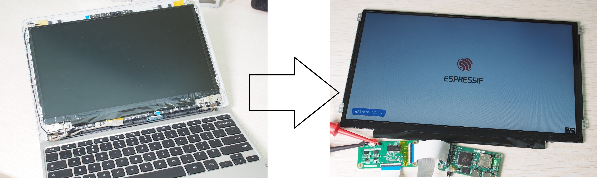
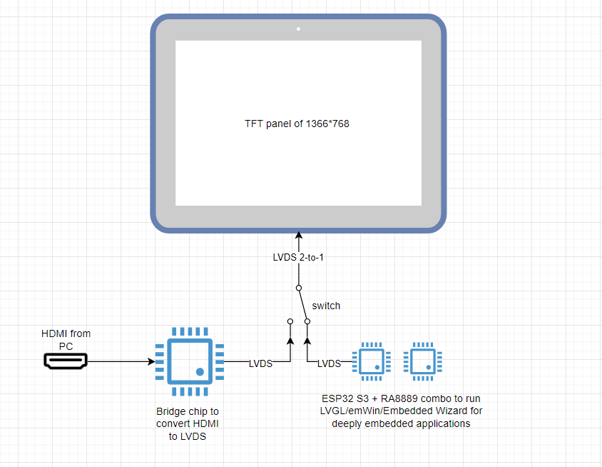
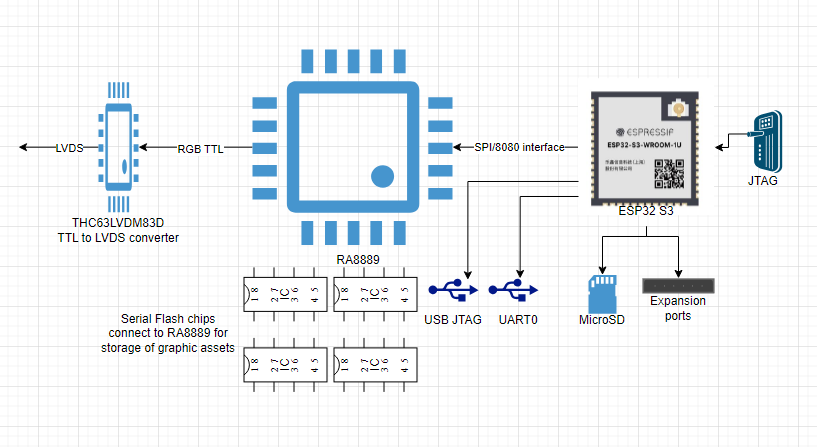
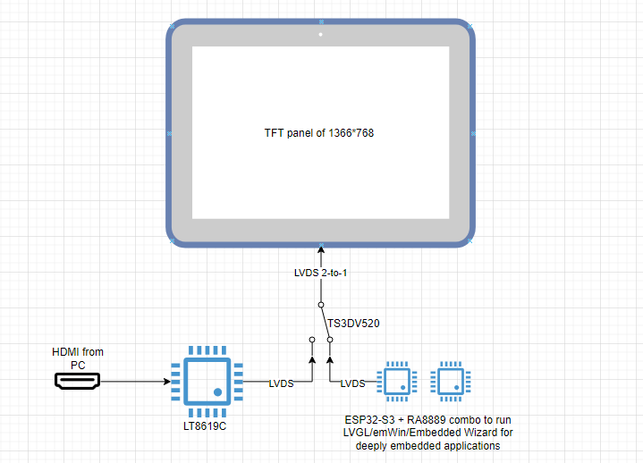

# ESP32-S3 LVDS Portable Monitor

1. [Features](#features)
2. [Introduction](#introduction)
4. [Choice of components](#components)

## Features 

* Recycle the LVDS LCD panel from a scrap laptop

  

* Dual video sources
  * ESP32-S3 with an external graphic controller
  
  * HDMI output from a PC or video game console
  
    Switching between ESP32-S3 embedded graphic and HDMI by a single button
  
* To be portable, that means a battery is required (the choice is HAC-003 replacement battery of [Nintendo Switch](https://en.wikipedia.org/wiki/Nintendo_Switch) due to its popularity and availability from [Amazon](https://www.amazon.com/Cameron-Sino-HAC-S-JP-EU-C0-BPHAT-C0/dp/B0B4574KHD/ref=sr_1_5?crid=152TWKXCC6L3G&dib=eyJ2IjoiMSJ9.KBA1LU6HkghYuO2zMG21Q9CHqIrSEcYTAryfSDKZdn6mVPcxXS_pnDzZ76IZLQXYnp5hFnudum2btR_tmeDr_Xtb5vvrHsSfHrGwAGn_e9podNuFDnYdxx8FllqWyds2fqDkz2E-vnwKm6l3WPhgfoHOwdCUufmo8QeR2B4i7X8pmsEYCJ2e_Ca3DsxCoO8ecOrDwVTbji32tF2Em8105mFnGBmegCnK-81NkYsewUA.ulGU-Y8dpL7ZON2fERcadvCQcjLxdKJXndFxqBZRM2k&dib_tag=se&keywords=HAC-003&qid=1720497336&sprefix=hac-00%2Caps%2C418&sr=8-5))

* 3-A Lithium battery charger with power path management so that you may charge as you work

* Charging status and mode of operations to be visualized on a thumb-sized IPS OLED display

* Audio codec with speaker driver and headphone amplifier onboard

* UART0 program download port onboard for ESP32-S3

* USB Debug port onboard for ESP32-S3

* JTAG port onboard for ESP32-S3

* MicroSD card for storage of graphic media

* Expansion port for all unused IO pins of ESP32-S3

## Introduction 

From time to time there are scrap laptops and tablets that you may have few units in the garage or store room with heavy dust on them. They are fully operational although a bit slow or just incompatible with the latest software. One of the most useful spare parts is the display panel that is still alive.

**This repository is to show you how to revitalize a scrap chromebook's 11.6" LVDS 18-bit display panel to a HMI panel of ESP32-S3 plus the bonus feature of being a portable monitor for the PCs.**

This is the idea of The ESP32-S3 LVDS Portable Monitor:

## Choice of components 

The LCD panels of laptops usually have a resolution of 1366*768 or higher with an interface called [LVDS](https://en.wikipedia.org/wiki/Low-voltage_differential_signaling). Such resolution requires more memory as the display buffer and a much faster pixel clock to drive so I need an external graphic controller ([RA8889](https://www.raio.com.tw/en/RA8889.html)) to generate the pixel clock and horizontal sync.

* Embedded graphic: ESP32-S3 + RA8889 + THC63LVDM83D with major components illustrated below.

* HDMI to LVDS bridge with three options from my knowledge:

  | Solution                                                     | Pros                                                         | Cons                                                         |
  | ------------------------------------------------------------ | ------------------------------------------------------------ | ------------------------------------------------------------ |
  | [LT8619C](http://www.lontiumsemi.com/small/262.html)         | Low cost, a direct conversion of HDMI to LVDS means simplicity, QFN package that is more easy for PCB layout | NDA required. Not much technical information. A promising source from GitHub with even the register map available [link](https://github.com/guitarhua/lt8619C_hdmi_converter) |
  | [TC358870XBG](https://toshiba.semicon-storage.com/ap-en/semiconductor/product/interface-bridge-ics-for-mobile-peripheral-devices/hdmir-interface-bridge-ics/detail.TC358870XBG.html) + [SN65DSI83](https://www.ti.com/product/SN65DSI83?bm-verify=AAQAAAAJ_____-tx30l7KuaysEBTfq7KnG4-FMHjvaeqFAj-4GRxIMAjHOLyO9eWArnPE4B5dBc10BtBxL97m4OFC78sHAFlYHFinu93XuYxOScmGpO0G8-f0sPx6fuAFftGnV3SOegzHN9aA0rGGuikcTQPKnyrmFlSmdSkVyzFfhEcGhIXcPl1TonSbt2UExfhfhHnKK8ZfoIMOk_1gb1hwSeaFMQUJnenrTVMBtK-8purFNmzvcTYuny-MyF6hoLJ1G1KQgORNGkhgNavkwQaKGo8yhkWUk3kUUsC1FkhA15eCf7soHRFghHt3iH0h-vWWrGxEXDiFJS8MoZ9MQKoNjJv0J8okft92SinO0Zh3Goegno) | Big companies, much better documentation, more information on GitHub available | BGA packages of both chips mean higher PCB production cost and layout skill. More expensive. An indirect conversion (HDMI>MIPI>LVDS). Extensive programming and configuration required for both chips |
  | Realtek RTD2660                                              | Using in consumer grade LED TVs and monitor in high volume. Much easier to get information from the Internet and GitHub. Low cost (around CNY8 only). Converting from VGA and analog video to LVDS too. | A bigger chip.                                               |

  I have chosen LT8619C for its smaller size and simpler PCB layout. Personally I love its package more than RTD2660. TC358870XBG + SN65DSI83 is too complex for this project.

* LVDS mux chip: [TS3DV520](https://www.ti.com/product/TS3DV520?&bm-verify=AAQAAAAJ_____-_r5zycZ2vn-XAgK8JWMCZzs0WqBU5CVndKTQ6ouMX_fO82oEeE3_8zNvA2PzaikN7bcPdjokNGKlUB-Y6XLx45G3qVJmq62-kDJb3ZdUX4PH0VUUDiCJVvlJ3fsyPYzB7T8pM0HMZliiivl0L7y_ksAcIj2sGahsQzNhVXCBZQfKC-jqMV1FMhQHUZNxhXbTU_RANNTELGUH-047xUhr5Bh9mgi9kAllcIBfFDPz9D586yvo1J_xfosBIKFFQa8BUIXrhbyRxyZ2c-nfsJqMu1C0q14WsniZDWJMImhw-c1A9Fl64BsTtxYQ5ZtOTmeTI) 5-Channel differential multiplexer switch for DVI/HDMI applications. This chip is compatible with LVDS switching as long as the bandwidth and voltage levels are within the operating conditions.

* TFT Panel: AUO 11.6" HD 16:9 Color TFT-LCD [B116XW03 V0](https://semiconductors.es/datasheet/B116XW03-V0.html). It is by no means the only panel to support. There are 1280*800 10.1" 8-bit IPS panels too. 

A revised system diagram is shown below:

